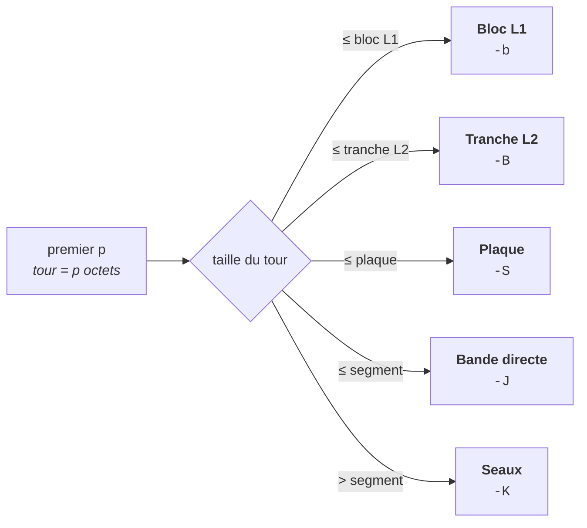

<div align="center">

# roue12

**Crible de premiers segmenté — roue mod 30, cinq étages de balayage, OpenMP**

[](https://github.com/nicoa2701/sieve/actions/workflows/ci.yml)
[](LICENSE)
[](main12.c)
[](#parallélisme)
[](#démarrage-rapide)

*Compte les premiers jusqu'à une borne, ou dans un intervalle arbitraire, jusqu'à 10¹⁶.*

**Français** · [English](README.md)

</div>

---

```console
$ ./roue12 1e12
Found 37607912018 primes up to 1000000000000 using 16 threads, segment 2048 KiB in 8.961s
```

> **π(10¹⁵) = 29 844 570 422 669** — compté en 5 h 24 min sur un Ryzen 7 9700X.

---

## Démarrage rapide

```bash
make            # -O3 -march=native -fopenmp
./roue12 1e12   # les premiers jusqu'à 10¹²
```

Aucune dépendance en dehors de la libc et d'OpenMP. `make` annonce le palier
SIMD retenu pour le pré-crible ; `make simd` détaille la détection.

```bash
./roue12 1e13 -d 1e11   # compte dans [10¹³, 10¹³ + 10¹¹]
./roue12 1e12 -v        # montre le dimensionnement retenu
make check              # 127 contrôles de validation
make sanitize           # ASan + UBSan, les deux variantes SINK_TAIL
```

---

## Mesures

### Provenance

| | |
|:--|:--|
| **Commit** | [`e29ec95`](../../commit/e29ec95) |
| **Date** | 2026-08-29, 13:24 |
| **CPU** | AMD Ryzen 7 9700X — 8 cœurs / 16 threads |
| **Threads utilisés** | 16 |


| Borne | π(N) | Temps | Croissance / décade |
|:--|--:|--:|--:|
| 10¹¹ | 4 118 054 813 | 0,722 s | — |
| 10¹² | 37 607 912 018 | 8,961 s | ×12,41 |
| 10¹³ | 346 065 536 839 | 115,7 s | ×12,91 |
| 10¹⁴ | 3 204 941 750 802 | 1 546,3 s | ×13,36 |
| 10¹⁵ | 29 844 570 422 669 | 19 446,3 s | ×12,58 |

Le facteur de croissance reste entre **×12,4 et ×13,4 par décade** sur toute la
plage mesurée : un surcoût stable au-dessus du ×10 de la plage elle-même, sans
décrochage quand la fenêtre de travail déborde chaque niveau de cache.

Les cinq comptages reproduisent les valeurs connues de la fonction de compte
des premiers π(N).

<details>
<summary><b>Méthode de mesure</b></summary>

<br>

Pour que les chiffres ci-dessus veuillent dire quelque chose, et pour qui
voudrait les reproduire :

- mesurer sur une machine par ailleurs au repos ;
- garder le même nombre de threads et le même dimensionnement entre les passages ;
- laisser le CPU refroidir entre deux mesures longues ;
- éviter toute charge de fond ;
- relever la fréquence CPU et l'éventuel throttling thermique aux grandes bornes.

Les passages longs comme 10¹⁴ et 10¹⁵ sont particulièrement sensibles à la
fréquence soutenue et au refroidissement. Le protocole complet, et la campagne
courante avec l'ablation de chaque étage à trois bornes, sont dans
[`MESURES.md`](MESURES.md).

</details>

---

## Comment ça marche

### Une roue mod 30 — un octet pour 30 entiers

Les multiples de 2, 3 et 5 ne sont jamais représentés. Seuls les huit résidus
premiers à 30 peuvent être premiers, si bien qu'un seul octet porte une plage
entière de 30 entiers, un bit par résidu :

| bit | 0 | 1 | 2 | 3 | 4 | 5 | 6 | 7 |
|:--|:-:|:-:|:-:|:-:|:-:|:-:|:-:|:-:|
| **résidu mod 30** | 1 | 7 | 11 | 13 | 17 | 19 | 23 | 29 |

Soit 73 % des entiers éliminés avant même que le crible ne commence — un octet
pour 30 entiers, contre un octet pour 16 dans un crible sur les seuls impairs.

Pour un premier `p`, un **tour** de roue couvre 30p entiers, exactement `p`
octets, et raye exactement 8 multiples — un par classe de résidu. Les décalages
en octets de ces 8 multiples à l'intérieur d'un tour sont les mêmes d'un tour à
l'autre : un tour se compile donc en une séquence déroulée fixe de 8 écritures
masquées et d'un pas `+p`. Le masque à appliquer ne dépend que de la classe de
résidu de `p` et de celle du multiple, ce qu'une table 8×8 précalculée donne
directement.

### Crible segmenté

La plage n'est jamais matérialisée. Elle est parcourue par segments dimensionnés
à l'exécution d'après les caches réellement détectés sur la machine, chaque
thread possédant son propre bitset de segment. Seuls les premiers de base
jusqu'à √N sont partagés.

### Pré-crible

Les premiers jusqu'à 113 ne sont jamais criblés. Leur motif combiné est
périodique, donc précalculé une fois pour toutes : les premiers sont répartis en
groupes dont la période — le produit des premiers du groupe — tient en cache, et
chaque segment est *initialisé* par un `ET` entre ces tables, quatre par passe,
au lieu d'être rempli de uns puis balayé. Intrinsèques AVX-512 quand la cible
les a, C portable vectorisable sinon.

### Les cinq étages

Le coût du rayage des multiples de `p` est dominé par le comportement du cache,
lequel dépend de la taille de son tour (`p` octets) au regard de la fenêtre de
travail. Chaque premier est donc dirigé vers l'étage qui correspond à son pas :



| Étage | Drapeau | S'applique à |
|:--|:-:|:--|
| **Bloc L1** | `-b` | les plus petits premiers ; le segment est balayé bloc par bloc pour que la fenêtre de travail reste en L1 |
| **Tranche L2** | `-B` | tour plus grand que le bloc, tenant encore dans une tranche taillée sur le L2 |
| **Plaque** | `-S` | quatrième étage, entre la tranche et le segment entier |
| **Bande directe** | `-J` | une passe droite sur tout le segment |
| **Seaux** | `-K` | les grands premiers, qui ne touchent une fenêtre donnée qu'une fois au plus |

Chaque étage s'éteint à `0` — c'est ainsi que se mesure la contribution propre
de chacun. `-v` rapporte les tailles retenues et le nombre de premiers tombés
dans chaque étage :

```console
$ ./roue12 1e12 -d 1e8 -v
Found 3618282 primes between 1000000000000 and 1000100000000
Wheel: 30
Threads: 8
Segment: 1024 KiB bitset (par thread, plafond L3 par thread (plaque))
Candidates/segment: 8388608
L1 block: 16 KiB, 1870 prime(s) blocked, p <= 16381
L2 chunk: 32 KiB, 1612 prime(s), p <= 32749
L2 slab: 128 KiB, 8739 prime(s), p <= 131071
Seaux: fenetre 32 KiB, 64 anneau(x), p > 2621440, marche roue 210
Presieve: primes <= 113 (27), 12 tables fused, 3 passe(s), 67 KiB
Chunks: 4 of 1 segment(s)
Time: 0.019025 s
```

<sub>Dimensionnement d'un i5-9300HF à 4 cœurs, pas de la machine de mesure. Le
verbeux nomme la tranche <code>L2 chunk</code> et la plaque <code>L2 slab</code>.</sub>

### Les seaux, pour les grands premiers

Passé une certaine taille, un premier marque si rarement que parcourir tout le
segment pour lui n'est plus que défaut de cache. Un tel premier est rangé dans
le seau de la **fenêtre** où il marquera la prochaine fois. Vider une fenêtre ne
parcourt alors que les premiers qui y ont effectivement du travail : chacun
reprend où il s'était arrêté, marque tant qu'il reste dans la fenêtre, puis est
reclassé dans la fenêtre où il retombe.

Les seaux sont des blocs de taille fixe recyclés dans un anneau : en régime
établi, plus aucune allocation. Le parcours emprunte une roue mod 210, ce qui
atteint les marques successives sans recalculer de division.

### Parallélisme

OpenMP sur des chunks de segments, que les threads se volent — huit chunks par
thread par défaut, de sorte qu'un chunk lent ne puisse immobiliser un cœur.
Chaque thread porte son propre segment, ses propres curseurs et son propre
anneau de seaux ; rien n'est partagé sur le chemin d'écriture. Le comptage final
est un popcount sur le bitset.

---

## Utilisation

```
roue12 [BAS] HAUT [-d DIST] [-s KiB] [-b KiB] [-m N] [-B KiB]
       [-S KiB] [-L N] [-K KiB] [-J N] [-t THREADS] [-c SEGMENTS]
       [-p PMAX] [-Q N] [-v] [-h]
```

Un seul nombre compte les premiers jusqu'à `HAUT`. Deux nombres comptent
l'intervalle `[BAS, HAUT]`, bornes comprises. `-d DIST` reprend la convention de
primesieve — `roue12 1e13 -d 1e11`. **Le coût suit la largeur de l'intervalle**,
plus le pré-crible des premiers jusqu'à √HAUT.

<details>
<summary><b>Toutes les options</b></summary>

<br>

| Drapeau | Signification |
|:-:|:--|
| `-d DIST` | intervalle donné en largeur : `[DÉBUT, DÉBUT + DIST]` |
| `-s KiB` | taille du bitset par thread — par défaut amortie sur les premiers de la bande du milieu, plafonnée au L3 par thread |
| `-b KiB` | blocage L1 ; par défaut deux tiers du L1 de données, divisés par le nombre de threads qui se le partagent |
| `-m N` | nombre de premiers passant par le chemin bloqué (0 = automatique) |
| `-B KiB` | tranche L2 ; par défaut un quart du L2 par thread |
| `-S KiB` | plaque, le quatrième étage ; par défaut le L2 par thread. S'éteint d'elle-même quand elle viderait la bande du milieu |
| `-L N` | bande de la plaque, en plaques (défaut 1 ; l'élargir a été mesuré perdant) |
| `-K KiB` | fenêtre de seau ; par défaut la tranche L2, ramenée à la puissance de deux qui pave le segment |
| `-J N` | frontière du seau, en fenêtres (0 = automatique : 2,5 segments) |
| `-t N` | nombre de threads (défaut : tous les CPU logiques) |
| `-c SEG` | segments par chunk, l'unité que les threads se volent (défaut : 8 chunks par thread) |
| `-p PMAX` | borne du pré-crible (défaut 113, 0 pour désactiver) |
| `-Q N` | distance de préchargement du vidage des seaux, en entrées (défaut 32) |
| `-v` | récapitulatif détaillé au lieu de la ligne unique |
| `-h` | aide |

Chacun des cinq étages s'éteint à `0`.

</details>

---

## Validation

```bash
make check      # 127 contrôles, 0 échec
make sanitize   # ASan + UBSan, les deux variantes SINK_TAIL
```

`make check` rejoue π(10ⁿ) contre les valeurs connues, les cas limites, les
intervalles hauts, 60 intervalles aléatoires contre une référence indépendante,
la cohérence sous quatorze configurations d'étages, et une régression par défaut
corrigé. Le protocole est figé dans [`check.sh`](check.sh) et rejouable.

La compilation est sans un seul avertissement sous `-Wall -Wextra`, y compris
sans `-fopenmp` et avec `-DRECOMPUTE_TURN=1`.

---

## Documentation

| Fichier | Contenu |
|:--|:--|
| [`MESURES.md`](MESURES.md) | la campagne de mesures courante, réécrite à chaque nouvelle |
| [`BUG.md`](BUG.md) | chaque défaut trouvé, avec son diagnostic et son correctif |
| [`HISTORIQUE.md`](HISTORIQUE.md) | le récit chronologique du travail |

---

## Licence

BSD 2-Clause — voir [`LICENSE`](LICENSE).
