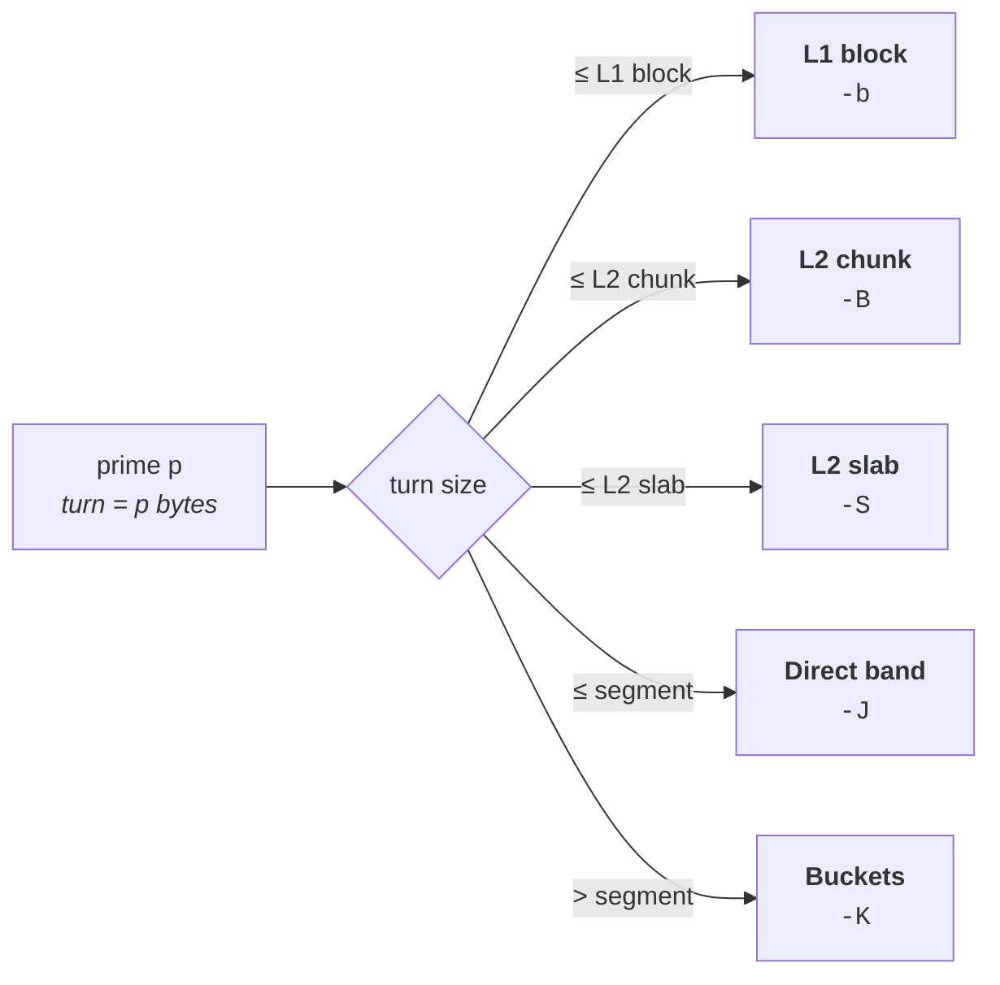

<div align="center">

# roue12

**A segmented prime sieve — mod-30 wheel, five sweep stages, OpenMP**

[](https://github.com/nicoa2701/sieve/actions/workflows/ci.yml)
[](LICENSE)
[](main12.c)
[](#parallelism)
[](#quick-start)

*Counts the primes below a bound, or inside an arbitrary interval, up to 10¹⁶.*

**English** · [Français](LISEZMOI.md)

</div>

---

```console
$ ./roue12 1e12
Found 37607912018 primes up to 1000000000000 using 16 threads, segment 2048 KiB in 8.961s
```

> **π(10¹⁵) = 29,844,570,422,669** — counted in 5 h 24 min on a Ryzen 7 9700X.

---

## Quick start

```bash
make            # -O3 -march=native -fopenmp
./roue12 1e12   # count primes up to 10¹²
```

No dependency beyond libc and OpenMP. `make` reports the SIMD tier picked for
the pre-sieve; `make simd` shows the detection in detail.

```bash
./roue12 1e13 -d 1e11   # count inside [10¹³, 10¹³ + 10¹¹]
./roue12 1e12 -v        # show the sizing actually chosen
make check              # 127 validation checks
make sanitize           # ASan + UBSan, both SINK_TAIL variants
```

---

## Benchmark results

### Provenance

| | |
|:--|:--|
| **Commit** | [`e29ec95`](../../commit/e29ec95) |
| **Date** | 2026-08-29, 13:24 |
| **CPU** | AMD Ryzen 7 9700X — 8 cores / 16 threads |
| **Threads used** | 16 |


| Limit | π(N) | Time | Growth / decade |
|:--|--:|--:|--:|
| 10¹¹ | 4,118,054,813 | 0.722 s | — |
| 10¹² | 37,607,912,018 | 8.961 s | ×12.41 |
| 10¹³ | 346,065,536,839 | 115.7 s | ×12.91 |
| 10¹⁴ | 3,204,941,750,802 | 1,546.3 s | ×13.36 |
| 10¹⁵ | 29,844,570,422,669 | 19,446.3 s | ×12.58 |

The growth factor stays between **×12.4 and ×13.4 per decade** across the whole
measured range: a stable overhead above the ×10 of the range itself, with no
cliff as the working set outgrows each successive cache level.

All five counts reproduce the known values of the prime-counting function π(N).

<details>
<summary><b>Benchmark methodology</b></summary>

<br>

For the numbers above to mean anything, and for anyone reproducing them:

- run on an otherwise idle system;
- keep the same thread count and segment configuration between runs;
- let the CPU cool between long measurements;
- avoid background workloads;
- record CPU frequency and thermal throttling when testing very large limits.

Long runs such as 10¹⁴ and 10¹⁵ are especially sensitive to sustained CPU
frequency and cooling. The full protocol, and the current campaign with its
ablation of every stage at three limits, are in [`MESURES.md`](MESURES.md).

</details>

---

## How it works

### A mod-30 wheel — one byte per 30 integers

Multiples of 2, 3 and 5 are never represented at all. Only the eight residues
coprime to 30 can be prime, so a single byte carries a whole span of 30
integers, one bit per residue:

| bit | 0 | 1 | 2 | 3 | 4 | 5 | 6 | 7 |
|:--|:-:|:-:|:-:|:-:|:-:|:-:|:-:|:-:|
| **residue mod 30** | 1 | 7 | 11 | 13 | 17 | 19 | 23 | 29 |

That is 73 % of the integers eliminated before the sieve even starts — one byte
per 30 integers, against one byte per 16 for an odd-only sieve.

For a prime `p`, one **turn** of the wheel spans 30p integers, exactly `p`
bytes, and crosses off exactly 8 multiples — one per residue class. The byte
offsets of those 8 multiples inside a turn are identical from turn to turn, so
a turn compiles to a fixed unrolled sequence of 8 masked writes and a `+p`
step. The mask depends only on the residue class of `p` and that of the
multiple, which is a precomputed 8×8 table.

### Segmented sieving

The range is never materialised. It is walked in segments sized at run time
from the caches actually detected on the machine, and each thread owns its own
segment bitset. Only the base primes up to √N are shared.

### Pre-sieve

The primes up to 113 are never sieved. Their combined pattern is periodic, so
it is precomputed once: the primes are split into groups whose period — the
product of the group's primes — fits in cache, and each segment is *initialised*
by `AND`-ing those tables together, four per pass, rather than filled with ones
and then swept. AVX-512 intrinsics when the target has them, vectorisable
portable C otherwise.

### Five sweep stages

Crossing off the multiples of `p` is dominated by cache behaviour, and that
depends on the size of its turn (`p` bytes) relative to the working set. Each
prime is therefore routed to the stage matching its stride:



| Stage | Flag | Applies to |
|:--|:-:|:--|
| **L1 block** | `-b` | small primes; the segment is swept block by block so the working set stays in L1 |
| **L2 chunk** | `-B` | turn larger than a block, still fitting an L2-sized chunk |
| **L2 slab** | `-S` | a fourth stage, between the chunk and the full segment |
| **Direct band** | `-J` | one straight pass over the whole segment |
| **Buckets** | `-K` | large primes, which touch any given window at most once |

Every stage switches off with `0` — which is how each one's individual
contribution gets measured. `-v` reports the sizes chosen and how many primes
landed in each stage:

```console
$ ./roue12 1e12 -d 1e8 -v
Found 3618282 primes between 1000000000000 and 1000100000000
Wheel: 30
Threads: 8
Segment: 1024 KiB bitset (par thread, plafond L3 par thread (plaque))
Candidates/segment: 8388608
L1 block: 16 KiB, 1870 prime(s) blocked, p <= 16381
L2 chunk: 32 KiB, 1612 prime(s), p <= 32749
L2 slab: 128 KiB, 8739 prime(s), p <= 131071
Seaux: fenetre 32 KiB, 64 anneau(x), p > 2621440, marche roue 210
Presieve: primes <= 113 (27), 12 tables fused, 3 passe(s), 67 KiB
Chunks: 4 of 1 segment(s)
Time: 0.019025 s
```

<sub>Sizing shown for a 4-core i5-9300HF, not the benchmark machine. Verbose
output is in French.</sub>

### Buckets, for the large primes

Past a certain size, a prime marks so rarely that walking the whole segment for
it is pure cache miss. Such a prime is filed instead into the bucket of the
**window** where it will next mark. Emptying a window then walks only the primes
that actually have work there: each resumes where it left off, marks while it
stays inside the window, and is refiled into the window it lands in.

Buckets are fixed-size blocks recycled through a ring, so the steady state
allocates nothing, and the walk uses a mod-210 wheel — consecutive marks are
reached without recomputing a division.

### Parallelism

OpenMP over chunks of segments, which threads steal from one another — eight
chunks per thread by default, so one slow chunk cannot strand a core. Each
thread carries its own segment, its own cursors and its own bucket ring;
nothing is shared on the write path. The final count is a popcount over the
bitset.

---

## Usage

```
roue12 [LOW] HIGH [-d DIST] [-s KiB] [-b KiB] [-m N] [-B KiB]
       [-S KiB] [-L N] [-K KiB] [-J N] [-t THREADS] [-c SEGMENTS]
       [-p PMAX] [-Q N] [-v] [-h]
```

One number counts the primes up to `HIGH`. Two numbers count the interval
`[LOW, HIGH]`, both bounds included. `-d DIST` follows the primesieve
convention — `roue12 1e13 -d 1e11`. **Cost follows the width of the interval**,
plus the pre-sieve of the primes up to √HIGH.

<details>
<summary><b>All options</b></summary>

<br>

| Flag | Meaning |
|:-:|:--|
| `-d DIST` | interval given as a width: `[START, START + DIST]` |
| `-s KiB` | bitset size per thread — default amortised over the primes of the middle band, capped at L3-per-thread |
| `-b KiB` | L1 blocking; default two thirds of the L1 data cache, split across the threads sharing it |
| `-m N` | number of primes taking the blocked path (0 = automatic) |
| `-B KiB` | L2 chunk; default a quarter of the L2 per thread |
| `-S KiB` | slab, the fourth stage; default the L2 per thread. Switches itself off when it would empty the middle band |
| `-L N` | slab band, in slabs (default 1; widening it measured as a loss) |
| `-K KiB` | bucket window; default the L2 chunk, rounded to the power of two paving the segment |
| `-J N` | bucket boundary, in windows (0 = automatic: 2.5 segments) |
| `-t N` | thread count (default: every logical CPU) |
| `-c SEG` | segments per chunk, the unit threads steal (default: 8 chunks per thread) |
| `-p PMAX` | pre-sieve bound (default 113, 0 to disable) |
| `-Q N` | prefetch distance when draining buckets, in entries (default 32) |
| `-v` | detailed summary instead of the single line |
| `-h` | help |

Each of the five stages switches off with `0`.

</details>

---

## Validation

```bash
make check      # 127 checks, 0 failures
make sanitize   # ASan + UBSan, both SINK_TAIL variants
```

`make check` replays π(10ⁿ) against the known values, edge cases, high
intervals, 60 random intervals against an independent reference, consistency
across fourteen stage configurations, and one regression test per fixed defect.
The protocol is frozen in [`check.sh`](check.sh) and is rerunnable.

The build is warning-free under `-Wall -Wextra`, including without `-fopenmp`
and with `-DRECOMPUTE_TURN=1`.

---

## Documentation

| File | Contents |
|:--|:--|
| [`MESURES.md`](MESURES.md) | the current measurement campaign, rewritten with each new one |
| [`BUG.md`](BUG.md) | every defect found, with its diagnosis and fix |
| [`HISTORIQUE.md`](HISTORIQUE.md) | chronological account of the work |

> These three files are written in French.

---

## License

BSD 2-Clause — see [`LICENSE`](LICENSE).
